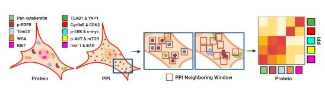

This folder contains the scripts and data to reproduce the result in the paper "Spatially resolved subcellular protein-protein interactomics in drug-perturbed lung-cancer cultures and tissues"

The large FOV demonstrates the network analysis of five PPIs across five cycles in HCC827 cells without treatment and with 100 nM Osimertinib treatment for 12 hours. The total cell number is 1186951 for untreated and 895560 for treated cells.

The quantification of PPI counts in HCC827 cells treated with and without Osimertinib.

A workflow of data analysis. The expression and spatial distribution of protein markers, as well as the localization of PPIs, were detected using iseqPLA and RapMIF.

Normalized co-expression of five PPIs with the mean intensity of six protein markers in single cells.

Comparison of AUC scores between the spPPI-GNN model, ML, MIL, and MLP model for prediction of single-cell treatment status in the 5PPI dataset.

# Organization

## Data
"data" folder contains all the necessary data to reproduce the results in the paper:
-

## Notebooks 
"notebooks" folder contains jupyter notebook script used:
- 

## Source code
"src" folder contains customs scripts used:
- "my_io.py" is the custom python scripts used for reading images and their info
- "pipeline_analyis_cellseg.cpproj" is used for cell profiler for single cell segmentation 

## Figures 
"figures" folder contains generated figures for the paper

## Citation
**Please Cite:**  Citation
